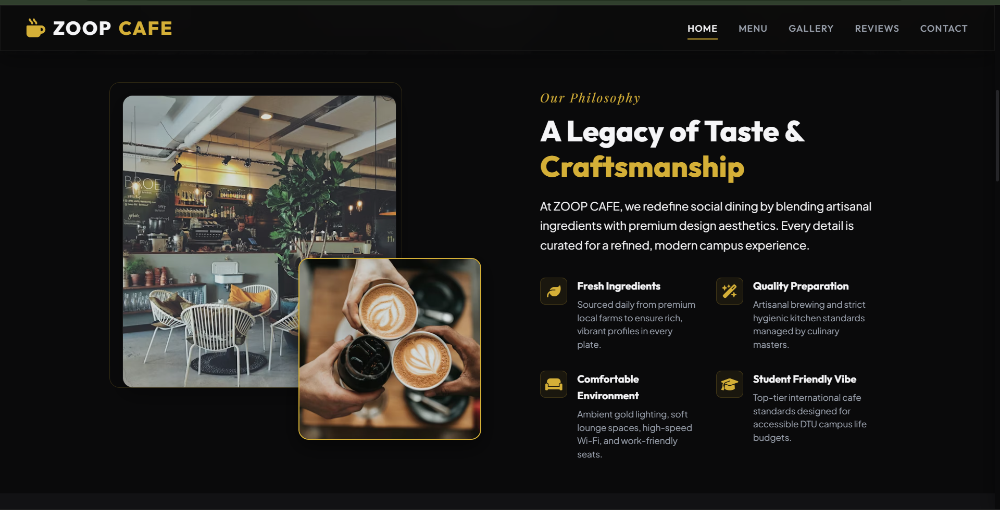
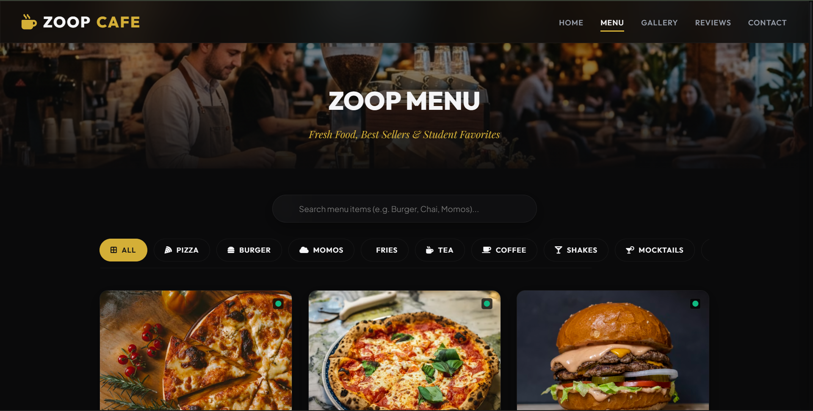
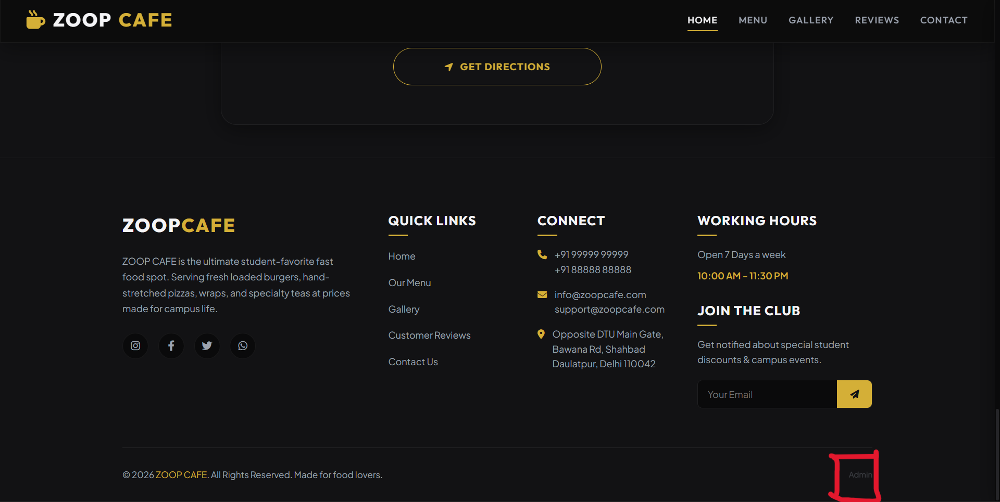

# Cafe Management System

A modern full-stack Cafe Management System designed for cafes and restaurants. The application provides menu management, customer reviews, gallery management, and admin controls through a secure authentication system.

## Features

### Customer Features
- View Menu
- Browse Food Gallery
- Browse Customer Gallery
- Read Reviews
- Contact Information
- Mobile Responsive Design

### Admin Features
- Secure Login
- Add Menu Items
- Edit Menu Items
- Delete Menu Items
- Upload Food Photos
- Manage Customer Gallery
- Manage Reviews
- Update Prices

## Technologies Used

### Frontend
- HTML5
- CSS3
- JavaScript

### Backend
- Node.js
- Express.js

### Database
- MongoDB

## Project Screenshots

(Add screenshots here)

## Future Improvements

- Online Ordering
- Table Reservations
- Loyalty Program
- QR Menu Access
- Analytics Dashboard

## Project Screenshots

### Home Page

### Home Page 2

### Menu Items

### Admin Login Button 

## Author

Praveen M
